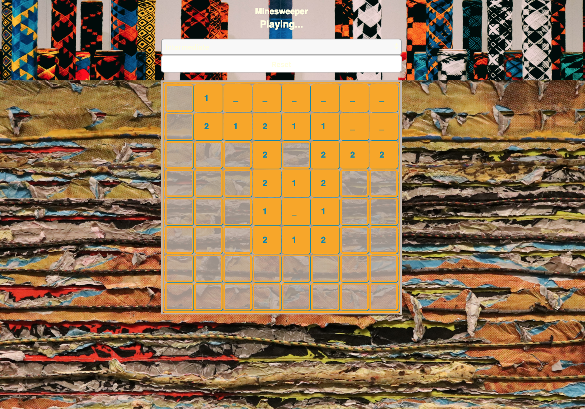

# Bomb Sniffer

#### Bomb Sniffer is a mock Minesweeper game.
#### A the user can choose the difficulty level which increases the size of the grid.
#### The user is able to select a grid cell to check whether or not there is a bomb.
#### If a bomb is selected, the user loses the game. A message appears above the grid to indicate that the user is the loser.
#### If all grid cells are selected without the user choosing a bomb containing grid cell, the user wins the game. A message appears above the grid to indicate that the user is the winner.

## Technology Used:
<!-- [HTML](https://html.com/) want to keep this commented as a reminder. -->
* [HTML](https://developer.mozilla.org/en-US/docs/Web/HTML)
* [CSS](https://developer.mozilla.org/en-US/docs/Web/CSS)
* [React](https://reactjs.org/)
* [Axios](https://www.axios.com/)
* [Minesweeper API](https://minesweeper-api.herokuapp.com/games)

## Live Site:
[Production URL](https://bomb-sniffer-garrettanderson.netlify.com)

